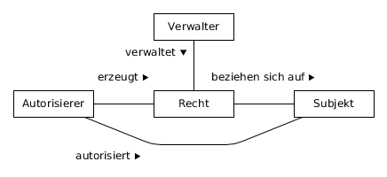

# Abstrakte Zugangs- und Zugriffskontrollmuster

## Autorisationsdurchsetzer

Der _Autorisationsdurchsetzer_ prüft Anfragen auf deren Autorisation und leitet diese entweder an ein geschütztes System weiter oder verweigert den Zugriff. Das Muster ist ein abstraktes Sicherheitsmuster [FY+14] und bildet den Rahmen für verschiedene Spezialisierungen.

*Auch bekannt als: Reference Monitor, Policy Enforcement Point, Authorization Enforcer*

### Kontext

Ein System, das eine schützenswerte Schnittstelle anbietet.
Der Begriff System ist abstrakt zu verstehen und soll durch Musterspezialisierungen eingeschränkt werden.
Spezielle Systeme können beispielsweise große Unternehmens-Anwendungslandschaften, die öffentliche Schnittstellen 
anbieten, aber auch Objekte mit definierter Schnittstelle innerhalb einer Anwendung sein.

### Problem

Wie kann der Zugang zum System bzw. Zugriff auf die Schnittstelle vor Missbrauch geschützt werden?
Das System hat eine schützenswerte Schnittstelle, die hinsichtlich der Sicherheitsziele Integrität, Vertraulichkeit
oder Verfügbarkeit geschützt werden sollen. Für die Schnittstelle wurden deshalb Autorisationsregeln basierend auf den
Schutzzielen spezifiziert. Wie können diese Regeln durchgesetzt werden?

### Zwänge

Folgende Zwänge wirken auf die Lösung ein:

* **Sicherheit:** Für das System müssen bestimmte Schutzziele eingehalten werden. Die Durchsetzung der Autorisation muss ein sicherer Mechanismus sein und sollte möglichst nicht korrumpiert werden können.
* **Benutzbarkeit:** Die Benutzbarkeit der Schnittstelle soll nicht beeinträchtigt werden.
* **Antwortzeit:** Die Antwortzeit des Systems soll nicht beeinträchtigt werden.

### Lösung

Alle Anfragen an die **schützenswerte Ressource** werden vom **Autorisationsdurchsetzer** abgefangen und auf ihre **Autorisation** hin überprüft. Hierzu werden die relevanten **Rechte** für die Überprüfung von der **Rechteablage** geladen. Autorisierte Anfragen werden an die **geschützte Ressource** weitergeleitet und unautorisierte Anfragen abgewiesen. Falls für die Überprüfung der Autorisation die Accountinformationen des anfragenden **Subjekts** benötigt werden, wird eine Authentifizierung eingeleitet.

Die Struktur des Autorisationsdurchsetzers ist auf der folgenden Abbildung dargestellt.

Nachstehend ist der Ablauf zur Durchsetzung der Autorisation skizziert.

### Konsequenzen

Folgende Erleichterungen bringt die Anwendung des Musters:

* **Sicherheit:** Die Autorisation wird durchgesetzt und somit wird für eine aktive Einhaltung der Schutzziele gesorgt.

Das Muster bringt folgende Lasten:

* **Sicherheit:** Schwachstellen bei der Umsetzung des Autorisationsdurchsetzers können direkt die Schutzziele der Ressourcen beeinträchtigen und schwere Folgen haben. 
* **Benutzbarkeit:** Durch die Kontrolle des Zugangs und Zugriffs werden vom Aufrufer in einigen Fällen Zusatzinformationen benötigt und so die Benutzbarkeit gemindert.
* **Antwortzeit:** Der Aufwand zur Prüfung der Autorisation erhöht die Antwortzeit des geschützten Systems.

### Verwandte Muster

* Falls zur Überprüfung der Autorisation Identitätsinformationen über das aufrufende Subjekt benötigt werden, wird ein **Authentifizierer** eingesetzt.
* Zur Beschreibung der Autorisation wird eine Spezialisierung des Musters zur **Autorisationsbeschreibung** verwendet.
* Die Autorisation für das System wird mit einem **Autorisierer** festgelegt.
* Zur gesicherten Protokollierung von Anfragen kann ein **Sicherheitslogger und -auditor** verwendet werden.

------------------------------------------------------------------------------
## Autorisationsbeschreibung

Mit der **Autorisationsbeschreibung** wird spezifiziert, welche Subjekte auf eine schützenswerte Ressource in welcher Form zugreifen dürfen. Die Autorisationsbeschreibung ist ein abstraktes Muster und gibt kontextabhängigen, komplexen
Spezialisierungen einen Rahmen.

### Kontext

Ein Umfeld in dem es schützenswerte Ressourcen gibt.

### Problem

Wie kann für eine schützenswerte Ressource beschrieben werden, wer in welcher Form auf sie zugreifen darf?
Schutzziele machen es notwendig Autorisationsregeln zu beschreiben, so dass entweder erlaubte oder nicht erlaubte
Aktionen identifiziert werden können. Wie können diese Autoriationsregeln beschrieben werden?

### Zwänge

Folgende Zwänge wirken auf die Lösung ein:

* **Skalierbarkeit:** Auch bei einer großen Anzahl von Subjekten sollte eine möglichst einfache Beschreibung möglich sein.
* **Komplexität:** Die Beschreibung der Autorisation der Subjekte sollte eine geringe Komplexität aufweisen. Je nach Kontext sollten auch Laien die Autorisation von der Beschreibung ablesen können.
* **Sicherheit:** Die Schutzziele der schützenswerten Ressource müssen vollständig erfüllt werden können. Jeder erlaubte sowie jeder unberechtigte Zugriff auf die schützenswerte Ressource muss beschrieben werden können.

### Lösung

Lege für die **schützenswerte Ressource** fest, welche **Subjekte** für welche Aktionen in welchem **Kontext** **Rechte** besitzen und somit autorisiert sind. 

Dieser Zusammenhang ist in der Strukturbeschreibung des Musters in der folgenden Abbildung dargestellt:

### Konsequenzen

Folgende Erleichterungen bringt die Anwendung des Musters:

* **Skalierbarkeit:** Je nach Umsetzung oder Spezialisierung des Musters, kann auch die Autorisation für eine Gruppe von Subjekten beschrieben werden und so eine höhere Skalierbarkeit erreicht werden.
* **Komplexität:** Die Autorisation kann variabel abhängig vom Kontext, dem Benutzer und den erlaubten Aktionen beschrieben werden und somit auch einfach ausfallen.
* **Sicherheit:** Jede Art der Berechtigung kann beschrieben werden. Es wird nicht sichergestellt, dass die
				Autorisation auch eingehalten wird.

Das Muster bringt folgende Lasten:

* **Komplexität:** Da der Kontext der Autorisation nicht eingeschränkt ist, können auch sehr komplexe Autorisationsregeln beschrieben werden.

### Verwandte Muster

* Als sehr flexibles Autorisationsmuster kommt die **Attributbasierte Zugriffskontrolle** diesem Muster sehr nahe. Im Gegensatz zur Attributbasierte Zugriffskontrolle legt die Autorisationsbeschreibung keinen Fokus auf Aussagen über Eigenschaften von Objekten, sondern beschreibt eine allgemeinere Variante.

------------------------------------------------------------------------------
## {Identitätsbasierte Autorisation}
\label{pat:iba}

Mit der \textsc{Identitätsbasierte Autorisation} werden für jedes identifizierbare Subjekt direkt die erlaubten Aktionen
auf schützenswerten Ressourcen beschrieben.

### Kontext

Ein Umfeld in dem es schützenswerte Ressourcen gibt.

### Problem

Wie kann die Autorisation von Subjekten beschrieben werden, wenn diese nicht vom Kontext abhängt?
Jedes Subjekt darf auf schützenswerten Ressourcen bestimmte Aktionen ausführen und das unabhängig vom Kontext.
Wie kann diese Autorisation beschrieben werden?

### Zwänge

Folgende Zwänge wirken auf die Lösung ein:

* Sicherheit:} Alle erlaubten und unerlaubten Berechtigungen der Subjekte müssen beschrieben werden können.
* Komplexität:} Die Beschreibung der Autorisation sollte möglichst simpel sein.

### Lösung

Spezifiziere für jedes \emph{Subjekt}, welche \emph{Rechte} für Aktionen es auf \emph{geschützten Ressourcen} hat.
Die Rechte hängen somit direkt an der Identität des Subjekts. Im Vergleich zur allgemeinen Autorisationsbeschreibung
wird der Kontext, in dem ein Recht gilt, spezialisiert. Der Zeitraum wird ausgeweitet auf die Lebenszeit eines Rechts.
Rechte können dabei einen Lebenszyklus durchlaufen. Der strukturelle Zusammenhang ist dargestellt in	
Abbildung \ref{fig:identitaetsbasierte_autorisation_struktur}.

\begin{figure}[H]
	\centering
		\includegraphics[width=0.6\textwidth]{figures/AbtrakteMuster/Identitaetsbasierte_Autorisation_struktur.png}
	\caption{Struktur der Identitätsbasierten Autorisation}
	\label{fig:identitaetsbasierte_autorisation_struktur}
\end{figure}

Zur Implementierung des Musters gibt es mehrere Möglichkeiten, die von der Interpretation der mehrfach Assoziation
abhängen. Der direkte Weg ist eine zentrale Zugriffskontrollmatrix,
die für alle Subjekte und schützenswerten Ressourcen die erlaubten Aktionen beinhaltet.
In Dateisystemen werden die Berechtigungen typischerweise mit den Dateien gespeichert. Der Datei ist in diesem Fall
eine Liste von erlaubten Aktionen je Betriebssystembenutzer, eine Zugriffskontrollliste, angehängt.
Eine dritte Variante sind Fähigkeitslisten (engl. capability list), die beim Benutzer gespeichert werden. Sie
beinhalten die erlaubten Aktionen des Benutzers für jede schützenswerte Ressource.

### Konsequenzen

Folgende Erleichterungen bringt die Anwendung des Musters:

* Sicherheit:} Für jedes Subjekt kann beschrieben werden, für welche Aktionen auf Ressourcen es autorisiert
				ist.
* Komplexität:} Sofern die Autorisation ausschließlich von der Identität von Subjekten abhängt, kann mit
				dieser Beschreibungsmöglichkeit jede Autorisation ohne Zusatzinformation abgebildet werden.

Das Muster bringt folgende Lasten:

	\item	\emph{Skalierbarkeit:} Die Lösung skaliert nicht mit der Anzahl der Subjekte. Die Autorisationslisten
				steigen proportional mit der Anzahl der Subjekte und entsprechend auch deren Ressourcenbedarf bei der Ablage.

### Verwandte Muster

	\item Die Identitätsbasierte Autorisation ist eine Spezialisierung der \emph{Autorisationsbeschreibung}. Das Problem
				wird dahingehend spezialisiert, dass eine direkte Autorisation von Subjekten unabhängig vom Kontext vorgesehen
				ist.
	\item Das \emph{Capability}-Muster \cite{Fe13} beschreibt eine implementierungsnahe Umsetzung des Musters, bei der
				die erlaubten Aktionen auf Ressourcen beim Subjekt gespeichert werden. Zur Umsetzung des Musters in 
				Webanwendungen bietet sich dieses Vorgehen an. In der Sitzung des Benutzers wird die Fähigkeitsliste gespeichert
				und beim Zugriff auf geschützte Schnittstellen kann direkt die Autorisation abgelesen werden.
	\item Das \emph{Authorization}-Muster \cite{Fe13} beschreibt eine Zugriffskontrolllösung basierend auf diesem Muster.
				Neben der Beschreibung des Musters wird in diesem auch auf die Durchsetzung eingegangen.

------------------------------------------------------------------------------
## {Rollenbasierte Autorisation}
\label{pat:rba}

Die \textsc{Rollenbasierte Autorisation} sieht eine Bündelung von Berechtigungen als Rollen vor. Eine Rolle repräsentiert
eine Verantwortlichkeit in einem bestimmten Kontext. Subjekte können Rollen einnehmen und erhalten auf diese Weise 
die Berechtigungen der Rolle.

### Kontext

Ein Umfeld in dem es schützenswerte Ressourcen gibt.

### Problem

Wie kann für eine große Anzahl an Subjekten der Verwaltungsaufwand für Berechtigungen gering gehalten werden?
Eine große Anzahl an Subjekten hat die gleichen Berechtigungen. Die Verwaltung der Berechtigungen ist aufwendig, 
da beispielsweise die Änderung einer Berechtigung die Anpassung vieler Subjekte nach sich zieht oder
ein neues Subjekt viele Berechtigungen zugewiesen bekommen muss.
Wie kann dieser Verwaltungsaufwand reduziert werden?

### Zwänge

Folgende Zwänge wirken auf die Lösung ein:

* Skalierbarkeit:} Eine große Menge ähnlicher Berechtigungen soll effizient verwaltet werden können.
				Unabhängig davon, ob die Anzahl der Berechtigungen durch die Subjekte oder Ressourcen bedingt werden.
* Ressourcenverbrauch:} Die Verwaltung vieler Einzelberechtigungen soll einen geringen Speicherverbrauch
				und Auswertungsaufwand haben.
* Sicherheit:} Die notwendigen Berechtigungen der Subjekte können beschrieben werden.

### Lösung

Führe \emph{Rollen} als Bündelung von \emph{Rechten} ein und autorisiere \emph{Subjekte} für den Zugriff auf
\emph{geschützte Ressourcen} durch die Zuweisung zu Rollen.
In der Autorisationsbeschreibung ist eine Zuweisung von Subjekten zu geschützen Ressourcen vorgesehen.
Statt dieser direkten Zuweisung, werden Rollen eingeführt und die Rechte von Subjekten indirekt durch Zuweisung
zu einer Rolle vergeben. Die Struktur des Musters zeigt Abbildung \ref{fig:rollenbasierte_autorisation_struktur}.

\begin{figure}[H]
	\centering
		\includegraphics[width=0.9\textwidth]{figures/AbtrakteMuster/Rollenbasierte_Autorisation_struktur.png}
	\caption{Struktur der Rollenbasierten Autorisation}
	\label{fig:rollenbasierte_autorisation_struktur}
\end{figure}

### Konsequenzen

Folgende Erleichterungen bringt die Anwendung des Musters:

* Skalierbarkeit:} Die Berechtigungen einer Vielzahl von Subjekten mit gleicher Rolle kann direkt durch
				Änderung der Rollenberechtigungen verändert werden. Der Verwaltungsaufwand ist somit stark reduziert.
* Ressourcenverbrauch:} Der Speicherverbrauch steigt nicht mehr proportional mit der Anzahl von Subjekten,
				da nicht mehr für jedes Subjekt alle Berechtigungen erteilt werden müssen;
				eine Zuweisung zu einer Rolle kann ausreichen.
* Sicherheit:} Jeder Benutzer kann über (extra) Rollen alle notwendigen Berechtigungen erhalten.

Das Muster bringt folgende Lasten:

	\item	\emph{Skalierbarkeit:} Die Zuweisung von Berechtigungen, die nur ein einzelnes Subjekt hat,
				muss durch eine extra Rolle vorgenommen werden. Für große Mengen an solchen Einzelberechtigungen ist dieses
				Muster nicht vorgesehen.

### Verwandte Muster

	\item Die \emph{Autorisationsbeschreibung} beschreibt eine abstrakte Lösung dieses Musters. In diesem Muster wird das
				Problem dahingehend spezialisiert, dass eine Vielzahl an gleichen Berechtigungen für Subjekte existiert. Zudem
				ist die Lösung unabhängig von der Verwendung des Kontexts zur Autorisation.
	\item Das \emph{Role-Based Access Control (RBAC)} \cite{Fe13} ergänzt dieses Muster um die Durchsetzung der Autorisation.
				Im Gegensatz zu diesem allgemeineren Muster, stammt RBAC aus dem Betriebssystemumfeld und sieht deshalb keine
				komplizierte Kombination mit anderen Autorisationsbeschreibungen vor.

------------------------------------------------------------------------------
## {Attributbasierte Autorisation}
\label{pat:aba}

Bei der \textsc{Attributbasierte Autorisation} wird die Autorisation von Subjekten durch Aussagen über die Eigenschaften
des Subjekts, des geschützten Objekts und der Umwelt beschrieben.

### Kontext

Ein Umfeld in dem es schützenswerte Ressourcen gibt.

### Problem

Wie kann die Autorisation erweiterbar beschrieben werden ohne komplexe Autorisationsregeln auszuschließen.

### Zwänge

Folgende Zwänge wirken auf die Lösung ein:

* Sicherheit:} Alle erlaubten und unerlaubten Berechtigungen der Subjekte müssen beschrieben werden können.
* Flexibilität:} Verschiedenste Arten von Autorisationen sollen beschrieben werden können. Die Beschreibung
				soll in möglichst vielen verschiedenen Kontexten genutzt werden können.

### Lösung

Beschreibe die \emph{Rechte} eines \emph{Subjekts} an Hand von \emph{Aussagen} über jegliche Attribute des
\emph{Subjekts}, der \emph{schützenswerten Ressource} oder der \emph{Umwelt}. Die Musterstruktur ist in Abbildung
\ref{fig:attributbasierte_autorisation_struktur} dargestellt.

\begin{figure}[H]
	\centering
		\includegraphics[width=0.6\textwidth]{figures/AbtrakteMuster/Attributbasierte_Autorisation_struktur.png}
	\caption{Struktur der Attributbasierte Autorisation}
	\label{fig:attributbasierte_autorisation_struktur}
\end{figure}

Von einer Kombination mit anderen \emph{Autorisationsbeschreibungen} im selben Kontext sollte abgesehen werden und 
stattdessen die Mächtigkeit der Attributbasierten Autorisation genutzt werden. In der Praxis hat sich gezeigt, dass
die Komplexität der Implementierung bei der Kombination mit anderen Beschreibungsmöglichkeiten zu Verwirrung führt.
Allerdings können Aussagen die meisten gängigen Autorisationsbeschreibungen abgebildet werden, beispielsweise indem
als Attribut die Rolle eines Subjekts verwendet und so eine \emph{Rollenbasierte Autorisation} ermöglicht wird.

### Konsequenzen

Folgende Erleichterungen bringt die Anwendung des Musters:

* Sicherheit:} Durch die Formulierung von Aussagen über jegliche Eigenschaften des Kontexts, ist diese
				Autorisationsbeschreibung sehr umfassend und jede Autorisation kann beschrieben werden.
* Flexibilität:} Es gibt keine Einschränkung hinsichtlich der Objekte über die Aussagen getroffen werden 
				können. Die Beschreibungsmöglichkeiten sind deshalb sehr variabel; es kann sich beispielsweise um 
				Rollen (Rollenbasiert) oder die Kennung (Identitätsbasiert) handeln.

Das Muster bringt folgende Lasten:

	\item	\emph{Komplexität:} Soll sich die große Flexibilität der Autorisationsbeschreibung auch in der Implementierung
				wiederfinden, so ist die Komplexität der Implementierung entsprechend hoch. Zudem bedarf das Auslesen
				von Objektattributen eine Erweiterbarkeit der Implementierung.

### Verwandte Muster

	\item Die \emph{Autorisationsbeschreibung} beschreibt eine abstrakte Lösung dieses Musters. In diesem Muster wird das
				Problem dahingehend spezialisiert, dass eine Flexibilität der Autorisation gefordert ist.
				Der Begriff des Kontexts wird zudem durch die Attribute von Objekten konkretisiert.
	\item Die \emph{Attribute-Based Access Control (ABAC)} \cite{YT05} ergänzt dieses Muster um die Durchsetzung der 
				Autorisation. Bei ABAC wird davon ausgegangen, dass die Autorisationsbeschreibung für das komplette System
				einheitlich ist.

------------------------------------------------------------------------------
## Autorisationsverwalter

Mit dem **Autorisationsverwalter** werden die Rechte von Subjekten zum Zugriff auf schützenswerte Ressourcen verwaltet. Die Autorisation wird entsprechend der Autorisationsbeschreibung abgelegt.

### Kontext

Ein Umfeld in dem es schützenswerte Ressourcen gibt.

### Problem

Wie können die Rechte der Subjekte auf schützenswerte Ressourcen verwaltet werden? In einem System sollen die Rechte der Subjekte zugänglich sein. Es muss somit der Lebenszyklus eines Rechts durchlaufen werden können. Wie kann der Lebenszyklus von Rechten gewährleistet und die Rechte anderen Systemen bereitgestellt werden?

### Zwänge

Folgende Zwänge wirken auf die Lösung ein:

* **Integrität:** Die Veränderung der Rechte kann verheerende Folgen für die betroffenen schützenswerten Ressourcen haben. Es soll vermieden werden, dass unberechtigt Rechte erstellt oder geändert werden.
* **Vertraulichkeit:** Über die Rechte von Subjekten lassen sich sicherheitsrelevante Rückschlüsse auf das System oder die einsetzende Organisation ziehen, somit sollen sie nur Autorisierten zugänglich sein.
* **Verfügbarkeit:** Die Prüfung der Autorisation ist eine zentrale Querschnittfunktionalität und hat direkten Einfluss auf die Verfügbarkeit der fachlichen Anwendung. Jede Zugangs- und Zugriffskontrolle erfordert das Prüfen der Autorisation. Das Laden der Rechte soll durchgehend möglich sein.
* **Skalierbarkeit:** Das System soll mit der Anzahl der verwalteten Rechte skalieren.
* **Speicherverbrauch:** Die abgelegten Rechte sollen wenig Speicher verbrauchen.

### Lösung

Die **Rechte** der **Subjekte** werden durch den **Autorisationsverwalter** verwaltet. Dieser stellt auch die Einhaltung des Lebenszyklus von Rechten sicher. Mit dem **Autorisierer** können Subjekte Rechte erhalten.

Es gibt verschiedene konkrete Lösungsmöglichkeiten für die Rolle des Autorisierers, beispielsweise:

* **Vergabe durch Ressourcenbesitzer:** Die Verantwortlichkeit zur Autorisierung liegt beim Ressourcenbesitzer. In Organisationen gibt es beispielsweise eine zentrale Instanz, die Rechte vergibt,	um so die Kontrolle in der Organisation zu behalten. In sozialen Netzwerken gilt hingegen der Benutzer als Ressourcenbesitzer und kann selbst andere Benutzer autorisieren.
* **Anfrage an Ressourcenbesitzer:** Subjekte können Rechte für geschützte Ressourcen erfragen, beispielsweise über einen Marktplatz auf dem mögliche Rechte angeboten und vom Subjekt angefragt werden. Gleichzeitig ist jeder geschützten Ressource ein Verantwortlicher zugewiesen, der die Rechteanfragen genehmigen kann.
* Als leichtgewichtige Variante wird die Autorisierung oft per Konfiguration ohne Benutzeroberfläche von einem kleinen Kreis Verantwortlicher durchgeführt. Diese Variante bietet sich bei einer geringen Autorisierungsanzahl oder sich selten ändernden Rechten an.

Die Struktur des Autorisationsverwalters sieht wie folgt aus:

### Konsequenzen

Folgende Erleichterungen bringt die Anwendung des Musters:

* **Integrität:** Durch den Autorisationsverwalter kann die unautorisierte Manipulation von Rechten sichergestellt werden.
* **Vertraulichkeit:** Die Benutzung des Autorisationsverwalters kann auf Autorisierte eingeschränkt werden.

Das Muster bringt folgende Lasten:

* **Fehlertoleranz:** Der Autorisationsverwalter ist ein Single Point of Failure und kann Angreifern die Änderung von Rechten erleichtern.

### Verwandte Muster

*Das Muster ist eingebettet in die Zugangs- und Zugriffskontrollmustersprache, aber auf Grund der geringen Verbreitung administrativer Muster sind keine verwandten Muster außerhalb der Sprache bekannt.*

------------------------------------------------------------------------------
## Authentifizierer

Mit dem **Authentifizierer** kann die Identität eines Subjekts verifiziert werden.

### Kontext

Ein Umfeld in dem Subjekte existieren und Accounts in einem System haben.

### Problem

Wie kann die Identität von Subjekten verifiziert werden?
Es ist notwendig, die Identität eines Subjekts zu verifizieren, um beispielsweise eine Zugriffskontrolle durchzuführen,
die Menge der Objekte für das Subjekt einzuschränken oder Zugriffe nachvollziehbar zu protokollieren.
Dabei muss sichergestellt werden, dass nur das Subjekt selbst sich authentifizieren kann und ein
Wie wird die Authentifizierung eines Subjekts in einem System durchgeführt?

### Zwänge

Folgende Zwänge wirken auf die Lösung ein:

* **Sicherheit:** Die Ablage der Authentifizierungsinformationen muss sicher sein und ein Angreifer sollte die Informationen weder einsehen noch ändern können.
* **Authentizität:** Der Mechanismus zur Authentifizierung muss sicher sein; es sollte sehr schwer sein, sich als jemand anderes auszugeben.
* **Nachahmbarkeit:** Der Authentifikationsnachweis sollte kaum imitiert werden können.
* **Benutzbarkeit:** Die Anmeldung am System darf keine Hürde bei der Benutzung der Funktionalität des Systems sein.
* **Performanz:** Trotz der Authentifizierung des Subjekts am System soll dieses noch performant funktionieren.
* **Skalierbarkeit:** Die Authentifizierung soll mit der Menge von Subjekten skalieren und nicht zum Bottleneck werden.
* **Flexibilität:** Auch sehr unterschiedliche Subjekte sollen sich authentifizieren können.
* **Zuverlässigkeit:** Subjekte sollen sich zuverlässig und sicher authentifizieren können. 
* **Verfügbarkeit:** Eine Authentifizierung soll als zentrale Funktionalität möglichst durchgängig gewährleistet werden.

### Lösung

Leite Anfragen des Subjekts an den Authentifizierer weiter. Dieser verifiziert an Hand des Identifikators und von
Authentifizierungsinformationen, die das Subjekt bereitstellt, mit abgelegten Authentifikationsnachweisen 
die Identität des Subjekts gemäß eines spezifischen Authentifizierungsprotokolls.
Authentifikationsnachweise sind spezielle Accountinformationen des Subjekts. Nach erfolgreicher Authentifikation
erhält das Subjekt einen Identitätsbeweis. Bei fehlgeschlagener Authentifikation wird der Identitätsbeweis zerstört.

Der Ablauf und die Struktur des Musters sind in der folgenden Abbildungen beschrieben:

### Konsequenzen

Folgende Erleichterungen bringt die Anwendung des Musters:

* **Abstraktion:** Es ist ein abstraktes Muster, das Spezialisierungen einen Rahmen bietet.

### Verwandte Muster

* Der **Authenticator** entspricht diesem Muster, wobei in dieser Musterbeschreibung eine einheitliche Sprache verwendet wird ([Fe13], [FY+14]).

------------------------------------------------------------------------------
## Identitäts- und Accountverwalter

Durch den **Identitäts- und Accountverwalter** wird der Lebenszyklus einer Identität und deren Accounts unterstützt. Dieses Muster ist ein abstraktes Sicherheitsmuster und bildet somit den Rahmen für verschiedene Lösungen.

### Kontext

Ein Umfeld in dem Subjekte existieren und Accounts in einem System haben.

### Problem

Wie können Informationen über Subjekte, somit deren Identität und Account, verwaltet werden?
Jedes Subjekt hat einen Account und Identitätsinformationen. Manche der Informationen sind datenschutzrechtlich sensibel
und haben somit unterschiedliche Sicherheitsanforderungen.
Wie und von wem können die Informationen des Subjekts verwaltet werden?

### Zwänge

Folgende Zwänge wirken auf die Lösung ein:

* **Sicherheit:** Die Verwaltung der Identitäts- und Accountinformationen ist zentral wichtig bei einer Authentifizierung und hat in diesem Fall Einfluss auf die Sicherheit des Systems.
* **Autorisation:** Nur befugte Personen sollen Identitäten und Accounts verwalten können.
* **Integrität:** Die 
* **Betriebskosten:** Der Betrieb der Lösung samt des zusätzlichen organisatorischen Aufwands beeinflussen die konkrete Lösung.
* **Implementierungsaufwand:** Der Aufwand bei der Implementierung beeinflusst die Lösung.
* **Zuverlässigkeit:** Die Verwaltung der Identitäts- und Accountinformationen soll zuverlässig möglich sein.
* **Benutzbarkeit:** Organisatorische Lösungen für Accountänderungen (bspw. das Passwortzurücksetzen) können die Benutzbarkeit aus Sicht des Endnutzers erheblich beeinträchtigen.
* **Flexibilität:** Die Verwaltung verschiedenster Subjekte soll ermöglicht werden.

### Lösung

Setze einen **Identitäts- und Accountverwalter** ein, der die Verwaltung von **Identitäten** und **Accounts** ermöglicht. Der Verwalter nutzt eine **Identitäts- und Accountablage** zur Speicherung der Informationen. Der **Registrierer** ist für die Vergabe neuer Accounts zuständig und stößt den Provisionierungsprozess an. Die zentralen Prozesse rund um den Lebenszyklus einer Identität werden von dem zentralen Verwalter umgesetzt. Der Verwalter kann je nach Anforderungen unterschiedliche Ausprägungen annehmen, beispielsweise:

* Die Rolle der verwaltenden Person kann von einer vertrauenswürdigen, **Zentralen Instanz**, beispielsweise einem zentralen Systemadministrator, übernommen werden.
* Die Subjekte nehmen die Rolle selbst ein (**Selfservice**) und können sich frei registrieren.
* Es wird **Unterstützter Selfservice** angeboten, das heißt, die Registrierung oder andere Aktionen können vom Subjekt angestoßen werden, aber werden erst nach Prüfung einer vertrauenswürdigen Instanz durchgeführt.

Die übliche Struktur des Musters stellt nachfolgende Abbildung dar:

Einige der Anwendungsfälle, wie die Account-Registrierung bzw. Account-Löschung samt Identitäts-Provisionierung bzw. Deprovisionierung, erfordern je nach Ausprägung und Anforderungen komplexere Prozesse. Diese Variationen sind in spezialisierten Mustern, wie dem Selfservice-Registrierer zusammengefasst.

Eine weitere Variationsmöglichkeit bietet die Platzierung der Identitäts- und Accountablage:

* Im Falle von Accounts für andere Systeme bzw. Services kann es durchaus sinnvoll sein, deren Informationen in einer Ablage direkt an den Anwendungen zu platzieren, die diese Informationen, beispielsweise für Zugriffsentscheidungen, benötigen. Eine solche **Anwendungslokale Identitäts- und Accountablage** ist im Falle von Informationen über menschliche Subjekte allerdings eine Quelle für Fehler und erzeugt größere Redundanz.
* Informationen über menschliche Subjekte werden üblicherweise in einer **Zentralen Identitäts- und Accountablage** zusammengeführt. Der Verwalter hat so eine einheitliche Sicht auf die Informationen.

### Konsequenzen

Folgende Erleichterungen bringt die Anwendung des Musters:

* **Abstraktion:** Es ist ein Anforderungsmuster, das Spezialisierungen einen Rahmen bietet.
* **Trennung von Belangen:** Das Muster sieht eine Aufteilung in unterschiedliche Belange, wie die Registrierung vor.

### Verwandte Muster

_Das Muster ist eingebettet in die Zugangs- und Zugriffskontrollmustersprache, aber auf Grund der geringen Verbreitung administrativer Muster [Fe13] sind keine verwandten Muster außerhalb der Sprache bekannt._

------------------------------------------------------------------------------
## Selfservice-Accountverwalter

Der **Selfservice-Accountverwalter** bietet Subjekten die Möglichkeit die Accountinformationen selbst zu verwalten.
Das Muster ist eine Spezialisierung des \emph{Identität- und Accountverwalters}.

### Kontext

Ein Umfeld in dem große Mengen von Subjekten existieren und einen Account in einem System haben.

### Problem

Wie können Informationen über Subjekte, somit deren Identität und Account, verwaltet werden?
Jedes Subjekt hat einen Account und Identitätsinformationen. Manche der Informationen sind datenschutzrechtlich sensibel
und haben somit unterschiedliche Sicherheitsanforderungen.
Wie und von wem können die Informationen des Subjekts verwaltet werden?

### Zwänge

Die Zwänge des abstrakten Musters wirken auch in diesem Muster.

### Lösung

Subjekten wird eine (skalierbare) Webanwendung zur Registrierung von Accounts und Verwaltung der eigenen 
Accountinformationen angeboten.

Lösungsvariante

Die Registrierung kann auch kontrolliert von einer zentralen Instanz durchgeführt, aber die
weitere Verwaltung der Accountinformationen von den Subjekten selbst übernommen werden. Diese Variante tritt auf,
wenn die Authentizität der Subjekte wichtig für das System ist.

### Konsequenzen

Folgende Erleichterungen bringt die Anwendung des Musters:

* Skalierbarkeit:} Durch die Bereitstellung einer Webanwendung können Subjekte die Informationen selbst
				verwalten. Die Bearbeitung wird nicht durch eine zentrale Instanz als Bottleneck behindert.
* Betriebskosten:} Im Gegensatz zu einer organisatorischen Lösung mit Personalaufwand, sind die
				Betriebskosten auf den Betrieb und die Wartung der Webanwendung reduziert.

Das Muster bringt folgende Lasten:

	\item	\emph{Implementierungsaufwand:} Für die Lösung muss eine eigene Webanwendung aufgesetzt werden.
* Authentizität:} Durch die (unkontrollierte) Registrierung der Accounts durch die Subjekte selbst,
				ist die Authentizität der Subjekte hinsichtlich ihrer wahren Identität nicht mehr gewährleistet. Zusätzliche
				Mechanismen, wie eine Ausweisverifikation per Post-Ident, müssten zur Wahrung der Authentizität ergänzt werden.
* Betriebskosten:} Für den Betrieb und die Wartung der Selfservice-Webanwendung müssen Personal und
				Rechenressourcen bereitgestellt werden.

### Verwandte Muster

	\item Der \emph{Identitäts- und Accountverwalter} gibt diesem Muster als Generalisierung einen Rahmen. Dieses Muster
				spezialisiert den Kontext dahingehend, dass eine große Anzahl an Subjekten zu verwalten ist und verstärkt
				somit den Zwang der Skalierbarkeit.

------------------------------------------------------------------------------
##  Selfservice-Registrierer

Der *Selfservice-Registrierer* erlaubt es Benutzern selbstständig Accounts für ihre Identität anzulegen, ohne dass eine zentrale Instanz diesen Prozess anstoßen muss. Das Muster ist eine Spezialisieurng der Registriererrolle des *Identitäts- und Accountverwalters*.

### Kontext

Ein Umfeld in dem Benutzer Accounts in einem System haben.

### Problem

Wie können neue Accounts in das System gelangen? Jeder Benutzer benötigt einen Account, um das System (oder dessen zentrale Services) nutzen zu können. Die Accounts müssen für die Benutzer erstellt werden, wobei die Benutzer nicht alle bekannt sind. Wie können Benutzer während des Betriebs des Systems Accounts in dem System erhalten?

### Zwänge

* **Skalierbarkeit:** Es wird eine große Menge Benutzer erwartet und die Erstellung der Accounts jedes einzelnen Benutzers durch eine zentrale Instanz ist zu aufwändig.
* **Authentizität:** Es soll sichergestellt sein, dass die Accounts zu der Identität gehören und nicht von Unbekannten erstellt wurden.
* **Usability:** Die Benutzer sollen eine niedrige Einstiegshürde zur Verwendung des Systems haben.

### Lösung

Die **Benutzer** können sich selbst beim **Selfservice-Registrierer** einen **Account** erstellen und erhalten so Zugriff auf das System. Die Accounts werden durch den Registrierer beim **Identitäts- und Accountverwalter** gemeldet, so dass Provisionierungsprozesse angestoßen werden können. Der Account wird aus Sicherheitsgründen erst nach erfolgreicher Prüfung der **Identität** freigeschaltet.

### Lösungsvarianten

- **Double-Opt-In** Benutzer müssen ihre Zustimmung zur Registrierung zusätzlich per E-Mail, SMS oder auf anderem Kontaktweg bestätigen. Damit ist die Echtheit des Kontaktwegs (mit einer gewissen Wahrscheinlichkeit) verifiziert und kann als Identitätseigenschaft aufgenommen werden.
- **"Ident"-Verfahren:** Die Prüfung der Identität des Benutzers wird an einen Dienstleister ausgelagert. Nach erfolgreicher Prüfung des Dienstleisters, wird die Identität des Accounts angenommen. Das Postident-Verfahren ist in Deutschland ein weitverbreiteter Weg zur Sicherstellung der Echtheit von Identitätsinformationen.
- **Direkte Accountfreischaltung:** Der Account ist direkt nach der Registrierung auch ohne Prüfung der Identität nutzbar. Eventuell werden bestimmte *kritische Aktionen* erst nach der Identitätsprüfung angeboten, das heißt, die Identität wird als Eigenschaft bei der Autorisationsdurchsetzung mit einbezogen.
- **Freischaltung durch vertrauenswürdige Instanz:** Jeder Account muss von einer vertrauenswürdigen Instanz freigeschaltet werden. Diese prüft, ob die Accountinformationen korrekt sind und schaltet den Account anschließend frei.

### Konsequenzen

* **Skalierbarkeit:** Jeder Benutzer kann sich selbst registrieren, wodurch die Eingabe der Accountinformationen nicht durch eine zentrale Instanz durchgeführt werden muss.
* **Authentizität:** Mit den verschiedenen Varianten können verschiedene Sicherheitsniveaus für die Authentizität eines Accounts sichergestellt werden.
* **Usability:** Mit einer direkten Accountfreischaltung können Benutzer ohne Wartezeit mit dem System interagieren. Kritische Aktionen können nichtsdestotrotz eingeschränkt werden.

### Verwandte Muster

* 

### Beispiele

* Die meisten sozialen Netzwerke (Facebook, Twitter) oder Webanwendungen (Google, Dropbox) für eine große Benutzerzahl bieten eine eigenständige Registrierung gekoppelt an ein Double-Opt-In-Verfahren an.
* Banken und Versicherungen koppeln die Registrierung meist an das Postident-Verfahren.

------------------------------------------------------------------------------
## {Organisations-Accountverwalter}
\label{pat:organizational_account_manager}

Beim \textsc{Organisations-Accountverwalter} werden die Accounts der Subjekte von einer zentralen, vertrauenswürdigen
Instanz in der Organisation verwaltet. Das Muster ist eine Spezialisierung des \emph{Identität- und Accountverwalters}
und ist selbst ein abstraktes Sicherheitsmuster.

### Kontext

Eine Organisation in der Subjekte existieren und einen Account in einem System haben.

### Problem

Wie können Accounts innerhalb einer Organisation verwaltet werden?
In einer Organisation gibt es verschiedene Mitglieder mit Accounts. Es ist wichtig, dass die Integrität der Accounts
und ihrer Informationen gewährleistet ist, da mit ihnen auf vertrauliche Informationen und Dienste der Organisation
zugegriffen werden kann.
Auf welche Weise können die Accounts in der Organisation unter Gewährleistung einer hohen Integrität verwaltet werden.

### Zwänge

Folgende Zwänge wirken auf die Lösung ein:

* Integrität:} Es ist wichtig, dass die Accountinformationen valide und überprüft sind. Die Accounts
				gewähren Zugang zu Systemen mit vertraulichen Informationen und sollen somit kontrolliert erstellt werden.
* Nachvollziehbarkeit:} Es soll nachvollziehbar sein, wer Änderungen an Accounts vorgenommen hat.

### Lösung

Accounts werden durch einen Prozess der Organisation nach Prüfung erstellt und auch jede Änderung der
Accountinformationen wird erst durch eine Instanz in der Organisation überprüft und dann durchgeführt.
Die Organisation hat so die Hoheit über Accounts und Accountinformationen.

\textbf{Lösungsvarianten}

Für die Verwaltung der Accounts kann als \textbf{Varianten} entweder eine Benutzeroberfläche zur Verfügung gestellt
werden oder die Accounts werden direkt in der Konfiguration der Systeme verwaltet.
Die Benutzeroberfläche soll die Kosten für die Accountverwaltung durch gesteigerte Effizienz senken.

Zudem kann das Integritätsbedürfnis der einzelnen Informationen eines Accounts feingranularer
spezifiziert und für weniger schützenswerte Informationen ein Selfservice nach dem Sicherheitsmuster 
\emph{Selfservice-Accountverwalter} ohne Überprüfung bereitgestellt werden.

### Konsequenzen

Folgende Erleichterungen bringt die Anwendung des Musters:

* Integrität:} Durch die Verwaltung und Prüfung der Accounts und ihrer Informationen durch die Organisation,
				wird die Integrität gewährleistet.
* Nachvollziehbarkeit:} Die Verwaltung durch die Organisation und womöglich in definierten Prozessen
				macht Änderungen nachvollziehbar.

Das Muster bringt folgende Lasten:

	\item	\emph{Skalierbarkeit:} Die verwaltenden Instanzen der Organisation können ein Bottleneck sein und zu Problemen
				bei einer großen Anzahl von Subjekten werden.
* Effizienz:} Die Accountinformationen können weniger effizient als beim Selfservice bearbeitet werden.
* Benutzbarkeit:} Für den Benutzer ist der Weg zur Änderung seiner Accountinformationen über die
				Organisation mit mehr Aufwand verbunden.
* Betriebskosten:} Innerhalb der Organisation müssen Personen zur Überprüfung und Änderung von
				Accountinformationen bereitgestellt werden.

### Verwandte Muster

	\item Der \emph{Identitäts- und Accountverwalter} gibt diesem Muster als Generalisierung einen Rahmen. Dieses Muster
				spezialisiert den Kontext dahingehend, dass die Verwaltung innerhalb einer Organisation angestrebt wird und
				die Integrität der Accountinformationen als größere Kraft auf die Lösung einwirkt.

------------------------------------------------------------------------------
%## {Auditierer und Logger}
%\label{pat:auditor_logger}
%
%Der \textsc{Auditierer und Logger} protokolliert sicherheitsrelevante Aktionen, um diese nachvollziehbar zu machen.
%
%### Kontext
%
%Ein Umfeld in dem es schützenswerte Ressourcen gibt und mit diesen interagiert werden kann.
%
%### Problem
%
%Der SChutz vor unautorisiertem Zugriff kann nicht ohne Einschränkung gewährleistet werden. Wie kann trotzdem...
%Wie kann festgestellt werden, ob sicherheitsrelevante Aktionen ohne Berechtigung durchgeführt wurden?
%Es werden Systeme angeboten, die Zugriff auf schützenswerte Ressourcen erlauben und es ist notwendig überprüfen zu 
%können, ob auf die schützenswerten Ressourcen ohne Autorisation zugegriffen wurde.
%Wie kann die Interaktion mit schützenswerten Ressourcen nachvollzogen werden?
%
%### Zwänge
%
%Folgende Zwänge wirken auf die Lösung ein:
%
%
%* Nachvollziehbarkeit:} Es soll nachvollziehbar sein, wer wann wie auf schützenswerte Ressourcen
%				zugegriffen hat.
%* Unabstreitbarkeit:} Wenn ein Subjekt auf eine geschützte Ressource zugegriffen hat, soll dies
%				möglichst beweisbar nachvollzogen werden können.
%* Skalierbarkeit:} Die Lösung soll mit der Zahl der Aktionen in einem System skalieren.
%
%
%### Lösung
%
%Fange Anfragen ab und leite sie an den \emph{Auditierer und Logger} weiter. Dieser protokolliert die Kontextdaten
%und stellt sie, sobald sie überprüft werden müssen, zur Verfügung.
%
%### Konsequenzen
%
%Folgende Erleichterungen bringt die Anwendung des Musters:
%
%
%* Nachvollziehbarkeit:} Alle Aktionen werden protokolliert und können im Nachhinein nachvollzogen werden.
%* Unabstreitbarkeit:} Die Aktionen können durch die Kontextdaten dem Verursacher zugeordnet werden.			
%* Skalierbarkeit:}
%
%
%Das Muster bringt folgende Lasten:
%
%
%* Unabstreitbarkeit:} Die Aktionen werden zwar samt Kontextdaten protokolliert, allerdings könnten die 
%				gespeicherten Daten verändert werden oder durch den Aufrufer manipuliert worden sein. Eine Authentifizierung
%				des Aufrufers und die Wahrung der Integrität der gespeicherten Daten könnte das Problem beheben.
%* Vertraulichkeit:} Die protokollierten Aktionen stellen unter Umständen schützenswerte Ressourcen dar, die
%				geschützt werden müssen.
%* Performanz:} Durch das Abfangen und Weiterleiten an den Auditierer und Logger ist ein zusätzlicher
%				Aufwand notwendig, der die Performanz des Systems beeinträchtigt.
%* Speicherverbrauch:} Die Protokollierung der Aktionen benötigt zusätzlichen Speicher.
%
%
%### Verwandte Muster
%
%
%	\item Der \emph{Security Logger and Auditor} \cite{Fe13} kann als Spezialisierung gesehen werden. Er setzt größeren
%				Wert auf die sichere Ablage der protokollierten Aktionen.
%	\item Der \emph{Reference Monitor} \cite{SF+06} beschreibt das Abfangen von Anfragen zur Prüfung der Autorisation und
%				kann mit dem \emph{Auditierer und Logger} kombiniert werden, um neben der Autorisationsprüfung die Anfragen
%				auch zu protokollieren.
%

[Fe13]: Fe13
[FY+14]: FY+14